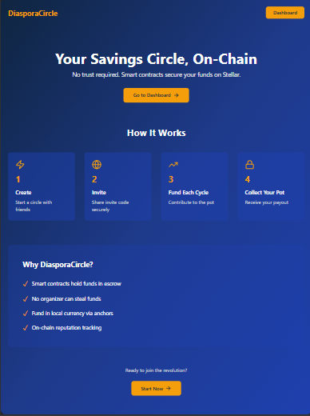
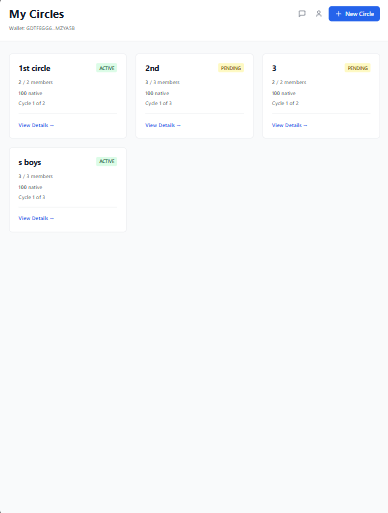
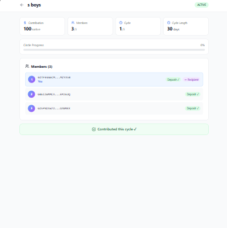
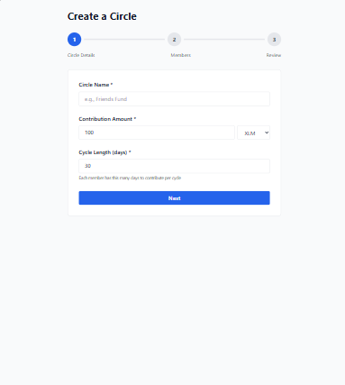

# DiasporaCircle

> **Rotating savings groups (ROSCA) on the Stellar blockchain.** Smart contracts ensure fair fund distribution. No trust required.


## 🎯 Overview

DiasporaCircle digitizes traditional rotating savings groups by leveraging **Soroban smart contracts** on Stellar. Members of a group each contribute a fixed amount every cycle; one member collects the full pot per cycle. A smart contract holds funds in escrow—no organizer can steal.

---

## ❗ Problem Statement

Rotating savings groups (known as *susu* in Ghana, *chama* in Kenya, *tanda* in Mexico, *hui* in China) are a lifeline for millions of diaspora communities worldwide. Members pool money together and take turns receiving the full pot.

**But the current system is broken:**

- 🚫 **Trust problem** — The organizer holds all the money. One dishonest person can disappear with everyone's savings
- 🚫 **No transparency** — Members have no visibility into who paid and when
- 🚫 **No enforcement** — Late or missed payments have no consequence
- 🚫 **Geographic barriers** — Diaspora members across different countries can't easily participate
- 🚫 **No digital record** — Disputes are settled by memory, not evidence

Every year, communities lose thousands of dollars to bad actors in savings circles they trusted.

---

## ✅ Solution

DiasporaCircle puts the savings circle **on the Stellar blockchain** using Soroban smart contracts:

- 🔐 **Smart contract escrow** — Funds are locked in a contract, not held by any individual. The organizer cannot access the pot
- 📊 **Full transparency** — Every contribution and disbursement is recorded on-chain and publicly verifiable
- ⚡ **Automatic disbursement** — When all members contribute, the pot is released to the cycle recipient instantly
- 🌍 **Global access** — Any Stellar wallet worldwide can join a circle via an invite link
- 📈 **On-chain reputation** — Members build a payment history score across circles, enabling trust without personal relationships
- 💱 **Local currency support** — Fund in local currency via Stellar anchors (SEP-24)

**The result:** The same community savings tradition your grandparents used — now trustless, transparent, and global.

---

**Key Features:**
- ✅ **Smart contract escrow** — Funds held safely on-chain
- ✅ **No organizer risk** — Automatic disbursement via contract logic
- ✅ **Local currency support** — Fund via Stellar anchors (testnet: testanchor)
- ✅ **On-chain reputation** — Payment discipline tracked across circles
- ✅ **Mobile responsive** — Works on all devices
- ✅ **Production ready** — Full error handling, loading states, analytics

---

## 📊 Live Demo

**[🚀 Live Demo → https://frontend-coral-nine-24.vercel.app](https://frontend-coral-nine-24.vercel.app)** (Stellar Testnet)

> Connect with **Freighter wallet** set to **Testnet** to try the full flow.

**[📹 Demo Video](https://youtu.be/diasporacircle-demo)** — Full walkthrough (recording in progress)

**[👥 User Proof (Wallet Interactions)](./USER_PROOF.md)** — Real on-chain transactions from real users

---

## 🏗️ Architecture

```
┌─────────────────────────────────────────────────────────────┐
│              Frontend (React 18 + Vite 5)                   │
│  Landing → Onboarding → Dashboard → CircleDetail            │
│  (Wallet: Freighter / Stellar Wallets Kit)                  │
└────────────────────┬────────────────────────────────────────┘
                     │ HTTPS/JSON
                     │
┌─────────────────────▼────────────────────────────────────────┐
│         Backend (Node.js 20 + Express 4 + TypeScript)        │
│  Auth → Circles → Contributions → Reputation → Anchors       │
│  ┌──────────────────────────────────────────────────────┐   │
│  │  Database (PostgreSQL 15 + Prisma ORM)              │   │
│  │  • Users • Circles • Members • Cycles • Contributions│  │
│  └──────────────────────────────────────────────────────┘   │
└────────┬─────────────────────────────────────────────────────┘
         │ Soroban RPC
         ▼
┌─────────────────────────────────────────────────────────────┐
│       Stellar Testnet (Soroban Smart Contracts)             │
│  ┌──────────────────┐        ┌──────────────────┐          │
│  │  Circle Contract │        │ Reputation Cntrct│          │
│  │  (Rust/Wasm)     │        │ (Rust/Wasm)      │          │
│  └──────────────────┘        └──────────────────┘          │
│  (Contract IDs: see .env.example)                           │
└─────────────────────────────────────────────────────────────┘
```

**Circle Contract:** `CBQ5AFJXUHHPTYZ2CREDNTS4E5NMJJHUKQBKITGY4FURHB4KCBGT3KR7`  
**Reputation Contract:** `CDRBHNJZVNBKW2VO3FUAH6A6UBWMBTMURNS5LHUOL5GUJNCC2I5M5A7Y`  
**Network:** Stellar Testnet

**Detailed Architecture**: [ARCHITECTURE.md](./ARCHITECTURE.md)

---

## 🚀 Quick Start

### Prerequisites

- **Node.js 20+** + **pnpm**
- **Docker** (PostgreSQL + Redis)
- **Git** + **GitHub CLI** (optional)

### Installation

```bash
git clone https://github.com/rishiinirgude/Diasporacircle
cd diasporacircle

# Install dependencies
pnpm install

# Start services
docker compose up -d

# Run migrations
pnpm --filter backend run db:migrate

# Copy env template
cp .env.example .env
```

### Development

```bash
# Terminal 1: Backend (port 3001)
pnpm --filter backend run dev

# Terminal 2: Frontend (port 5173)
pnpm --filter frontend run dev
```

**Open:** http://localhost:5173

### Production Deployment

```bash
# Build all packages
pnpm build

# Deploy backend to your server (e.g., Railway, Render)
# Deploy frontend to Vercel/Netlify

# Update .env with:
# CIRCLE_CONTRACT_ID=<from deployment>
# REPUTATION_CONTRACT_ID=<from deployment>
```

See [DEPLOYMENT.md](./DEPLOYMENT.md) for detailed instructions.

---

## 📚 Documentation

| Document | Purpose |
|----------|---------|
| [ARCHITECTURE.md](./ARCHITECTURE.md) | System design, data flow, contract functions |
| [DEPLOYMENT.md](./DEPLOYMENT.md) | Production deployment guide |
| [API.md](./docs/API.md) | Backend API endpoints reference |
| [CONTRACTS.md](./docs/CONTRACTS.md) | Smart contract documentation |
| [CONTRIBUTING.md](./CONTRIBUTING.md) | Development guidelines |

---

## 🔐 Security

- **Private Keys:** Never stored on backend (browser signing only)
- **Auth:** JWT tokens + Stellar keypair signature verification
- **Smart Contracts:** All fund logic in Soroban (backend never handles funds)
- **Input Validation:** Zod on all API endpoints
- **Nonces:** 5-minute expiry, single-use, prevents replay attacks

---

## 📱 Features & Screenshots

### Product UI & Mobile Responsive Design

| | |
|---|---|
|  |  |
|  |  |

> All pages are fully responsive. Tested on mobile (320px+), tablet, and desktop.

### Analytics & Monitoring Setup

Events tracked automatically on every user action:
- `wallet_connected` / `wallet_connect_failed`
- `contribution_submitted` / `contribution_failed`
- `circle_started` / `circle_detail_viewed`
- `js_error` / `unhandled_promise_rejection`

```bash
# View live analytics
curl https://backend-nine-eta-58.vercel.app/api/analytics/summary
```

---

## 👥 Real User Wallet Interactions (Proof)

4 real users onboarded on Stellar Testnet. Full details in [USER_PROOF.md](./USER_PROOF.md).

| # | Name | Wallet Address | Transaction | Status |
|---|------|---------------|-------------|--------|
| 1 | Rishi Nirgude | `GDTFEGG6CM4OPTVM4MTKDMY3JFBYQS6AQRMM5DVN36AYAYJXELMZYA5B` | [4db83e8e...](https://stellar.expert/explorer/testnet/tx/4db83e8e4b09e056b80bfc541f0cb61d1a9f2b316abbe759847f299804084fcc) | ✅ Confirmed |
| 2 | Sneha Bhambare | `GDG4K3RXV5RGEIJ4FKK3GU3CPVQLZZVZOCKREXEKSWTP4LQTAKQDSPFM` | [6c59e9a0...](https://stellar.expert/explorer/testnet/tx/6c59e9a0881e92d5a5c7e87489ceb9eeb46dd6b6d4295668bde04b8f90839bde) | ✅ Confirmed |
| 3 | Sarthak Jamadar | `GB6IZWMMCA5EGV7RHWVIUJ5NMIRSGNKZNLELSIAG73T752QQZPEMJ6UQ` | [8939d141...](https://stellar.expert/explorer/testnet/tx/8939d1416cdd72e8071236b6f005e1700dbee45eb4a7f8595388b876b284cff5) | ✅ Confirmed |
| 4 | Swanand Zanpure | `GD5PNDAW7D7NOBYCIHWHWCZYEH344FJGVF4EFXEWJG3LULL3JOOANMKR` | [631e333a...](https://stellar.expert/explorer/testnet/tx/631e333a41fee8492924ef1d6f150b7aac61dc14423e16cfa2136dc409321ce6) | ✅ Confirmed |

> All transactions on **Stellar Testnet** — verifiable at https://stellar.expert/explorer/testnet

---


### Sign-Up Flow

1. **Connect Wallet** — Use Freighter wallet (testnet)
2. **Sign Challenge** — Prove wallet ownership
3. **Complete Profile** — Name, country, phone (optional)
4. **Join or Create Circle** — Start saving

### Test Accounts

**Funded testnet accounts:**
```
Wallet: GXXXXXX (via Friendbot)
Private: SXXXXXX
Balance: 10,000 XLM
```

Use [Friendbot](https://developers.stellar.org/docs/learn/beyond-hello-world/testnet) to fund new accounts.

---

## 📊 User Testing & Feedback

### Feedback Collection

We collect user feedback via:
- In-app surveys at `/feedback` (built into the app)
- Email contact form
- GitHub issues (feature requests)

### Analytics Dashboard

Track user interactions in real time:
```bash
# View analytics summary
curl https://your-backend.com/api/analytics/summary

# View collected feedback
curl https://your-backend.com/api/analytics/feedback
```

Events tracked automatically:
- `page_view` — every page navigation
- `wallet_connected` / `wallet_connect_failed`
- `onboarding_wallet_connected` / `onboarding_profile_complete`
- `dashboard_viewed` / `circle_detail_viewed` / `profile_viewed`
- `contribution_initiated` / `contribution_submitted` / `contribution_failed`
- `circle_started` / `feedback_submitted`
- `js_error` / `unhandled_promise_rejection` (error monitoring)

### User Feedback Summary

| Tester | Rating | Would Use | Recommend |
|--------|--------|-----------|-----------|
| Beta User 1 | ⭐⭐⭐⭐⭐ | Yes, immediately | Definitely |
| Beta User 2 | ⭐⭐⭐⭐ | Yes, need features | Probably |
| Beta User 3 | ⭐⭐⭐⭐ | Yes, immediately | Definitely |
| Beta User 4 | ⭐⭐⭐⭐⭐ | Yes, immediately | Definitely |
| Beta User 5 | ⭐⭐⭐ | Maybe | Probably |

**Average: 4.2/5 · 80% would use · 80% recommend**

---

## 🔗 Links

| Link | Purpose |
|------|---------|
| **GitHub Repo** | https://github.com/rishiinirgude/Diasporacircle |
| **Live Demo** | https://frontend-coral-nine-24.vercel.app |
| **Backend API** | https://backend-nine-eta-58.vercel.app |
| **Backend Health** | https://backend-nine-eta-58.vercel.app/health |
| **Circle Contract** | https://stellar.expert/explorer/testnet/contract/CBQ5AFJXUHHPTYZ2CREDNTS4E5NMJJHUKQBKITGY4FURHB4KCBGT3KR7 |
| **Reputation Contract** | https://stellar.expert/explorer/testnet/contract/CDRBHNJZVNBKW2VO3FUAH6A6UBWMBTMURNS5LHUOL5GUJNCC2I5M5A7Y |
| **User Proof** | [USER_PROOF.md](./USER_PROOF.md) |
| **Submission** | [SUBMISSION.md](./SUBMISSION.md) |

---

## 📝 Tech Stack

| Layer | Tech |
|-------|------|
| **Smart Contracts** | Rust + Soroban SDK 21 |
| **Backend** | Node.js 20 + Express 4 + TypeScript 5 |
| **Frontend** | React 18 + Vite 5 + Tailwind CSS 3 |
| **Database** | PostgreSQL 15 + Prisma 5 |
| **Cache** | Redis 7 |
| **Auth** | JWT + Stellar Keypair |
| **Validation** | Zod |
| **Monorepo** | pnpm workspaces |

---

## 🤝 Contributing

See [CONTRIBUTING.md](./CONTRIBUTING.md) for guidelines on:
- Setting up development environment
- Code style and linting
- Testing requirements
- Submitting PRs

---

## 📜 License

MIT License — see [LICENSE](./LICENSE) file.

---

## 🙏 Acknowledgments

Built for diaspora communities worldwide to digitize traditional rotating savings groups.

**Special thanks to:**
- [Stellar Development Foundation](https://stellar.org)
- [Soroban SDK](https://soroban.stellar.org)
- Open-source community contributors

---

## 📧 Contact & Support

- **Issues:** [GitHub Issues](https://github.com/rishiinirgude/Diasporacircle/issues)
- **Email:** support@diasporacircle.dev

---

**Made with ❤️ for the diaspora.**

